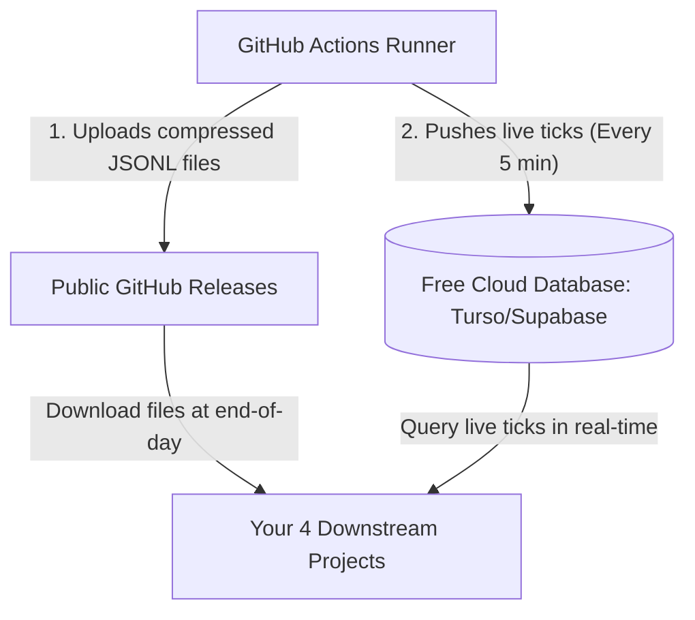

# NSE Central Hub Data Integration Guide

This guide explains how your **4 other projects** can consume the data captured by the automated **NSE Central Hub** daily streamer running on GitHub Actions.

---

## Data Collection & Automation Architecture
The scraper is **100% automated** and operates without manual intervention:
1. **NSE Connection & Akamai Evasion:** The streamer uses `Scrapling` and automated headers to fetch fresh sessions and bypass Akamai bot blockers.
2. **Dynamic Expiries:** The script automatically calculates and updates Weekly and Monthly option expiries every day.
3. **Resilience:** If the connection drops, the ghost-stream handler catches it and retries in a background loop with exponential backoff.
4. **Time Windows:** Automated runs run in two shifts (9:15 AM - 12:30 PM and 12:30 PM - 3:30 PM IST) to capture the full market day.

---

## How Your 4 Other Projects Can Access the Data

Since GitHub Actions runners are behind a secure firewall and do not expose open inbound ports, downstream projects cannot make direct HTTP or ZMQ connections to the runner VM. Instead, they consume data through **two main patterns**:



### Pattern 1: End-of-Day Historical Analysis (Files)
At the end of the morning and afternoon runs, the data is pushed to your public repository's **Releases**. Any downstream project can automatically pull and download these files.

#### Downstream Python Consumer Code:
You can put this python snippet in any of your 4 other projects to automatically pull and extract the latest market data lake files:

```python
import os
import requests
import tarfile

def download_latest_ticks(dest_dir="./data_lake"):
    os.makedirs(dest_dir, exist_ok=True)
    
    # 1. Fetch latest release info from your public repo
    api_url = "https://api.github.com/repos/highmachs/nse-historical-ticks/releases/latest"
    response = requests.get(api_url).json()
    
    # 2. Get download URL for daily_ticks_data.tar.gz
    assets = response.get("assets", [])
    if not assets:
        print("[-] No assets found in the latest release.")
        return
        
    download_url = assets[0]["browser_download_url"]
    archive_path = os.path.join(dest_dir, "latest_ticks.tar.gz")
    
    # 3. Download the archive
    print(f"[+] Downloading daily ticks from: {download_url}")
    with requests.get(download_url, stream=True) as r:
        r.raise_for_status()
        with open(archive_path, 'wb') as f:
            for chunk in r.iter_content(chunk_size=8192):
                f.write(chunk)
                
    # 4. Extract
    print("[+] Extracting tick files...")
    with tarfile.open(archive_path, "r:gz") as tar:
        tar.extractall(path=dest_dir)
        
    print("[SUCCESS] Daily ticks data lake is synchronized locally!")

if __name__ == "__main__":
    download_latest_ticks()
```

---

### Pattern 2: Live Real-Time Querying (Database)
If your downstream projects require **real-time updates during market hours** (e.g. live signal generation or paper trading), we can add a sync step that writes the data directly to a **free managed database** (like **Turso** or **Supabase**).

1. **How it works:** Every 1–5 minutes, a background thread in the GitHub Actions runner bulk-inserts the latest in-memory cache of ticks into a cloud database.
2. **Access:** Your 4 other projects connect to the same cloud database and query the latest prices instantly.
3. **Pricing:** Since Turso offers 9 GB of free SQL storage (enough for 2+ years of tick snapshots), this is completely free.

---

### Pattern 3: Local Swarm Run
If you are developing locally on your laptop, you can start the hub directly:
```bash
python data_gateway.py
```
This starts the local web server on port `41937` and the ZMQ publisher on port `5555`. Any local script on your machine can access the REST API endpoints like `http://localhost:41937/api/quote?symbol=NIFTY` or subscribe to the ZMQ socket.
